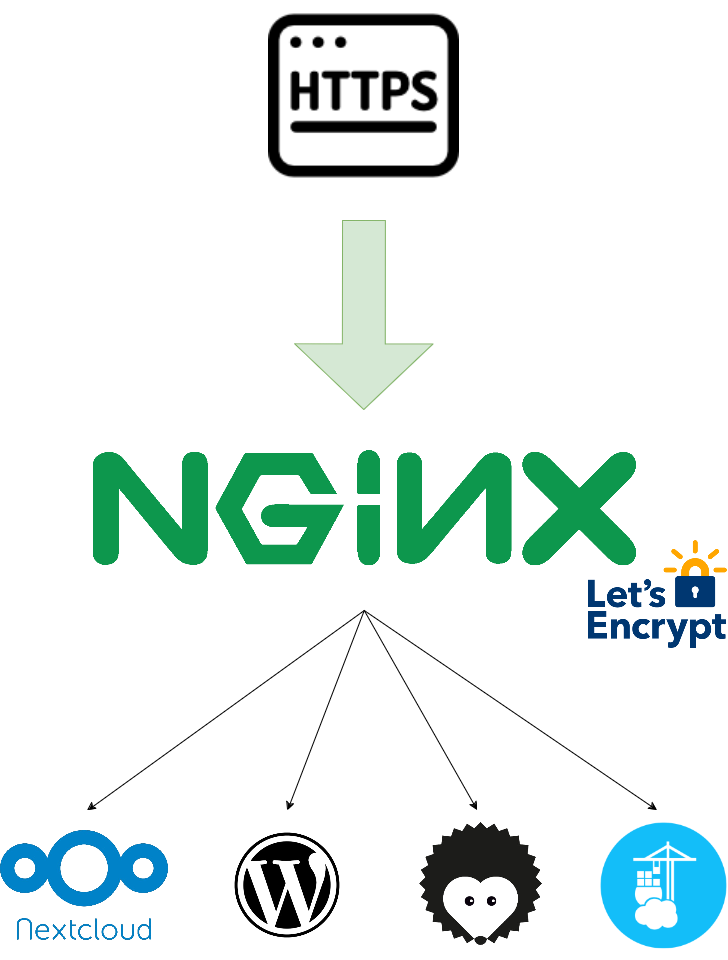

# composeFilesNScripts
A repo to stock my compose files and scripts I made during my free time. Those compose files worked for me and are fairly inspired by those you can already find online. However I had to change some volumes, networks or environment variables to make them work on my infrastructure.
I also created a lil bash script that asks the user what to install and then creates and executes the compose files in serparate directories. This script is just a temporary solution as I plan on creating an Ansible playbook to do these tasks instead.

Each compose has it's own directory in which you can find the README.md file that details the entirety of the file. If some informations are missing or are incorrect please contact me using the informations from the "Authors and contributors" section.

*Note that every compose file has environment sections with no values. It is because I used .env files to pass those variables to the file when it is executed. You will find some example .env files in this directory so you can have a better idea as to what to put in there.*

## What did I wanted to achieve with those compose files
I didn't really have any precise idea of what to do when I started this project, I just wanted to strengthen my skills with Docker containers. I then bought a domain name along with a tiny server to practice and deploy services that I could test using a classic Internet connection. The first few things that came to mind were Wordpress and Nextcloud, so I deployed both using a reverse proxy (nginx) and a Letsencrypt container for the certificates.

Now the compose files uploaded are used by me to test new tools or functionalities.

## Infrasructure
Basically this infrastructure is just some services behind a reverse proxy. There isn't much to say about it but I did a little diagram explaining everything :

*Note that every app is a Docker container, even the Nginx reverse proxy and the lets encrypt companion. As explained above everything will be detailed in the README.md of the specified service.*

I did have one interesting thing to set up, and it was the networks. An external network is created to allow the apps to communicate with the reverse proxy and the external requests, but to prevent databases to be accessible from the outside I created multiple internal networks to manage connections between the apps and their databases. 

## Services
I'll put a bit more details on the diffrent apps I deployed along with their state and the links to the developer's website.

### Reverse proxy
The reverse proxy is used to redirect the requests made by users to the right service. We're gonna use hostname (created in the DNS of my provider) to point to the right container/service.

The reverse proxy that is set-up there is an automated proxy that will modify it's own configuration depending on some environment variables put in some containers. You can pull this image directly from the Dockerhub at [this URL](https://hub.docker.com/r/jwilder/nginx-proxy). The official repo is available [there](https://github.com/nginx-proxy/nginx-proxy).

I also use a let's encrypt companion that will generate certificates and pass them to the reverse proxy. This allows my services to be accessible via https requests, being a bit more secured (even if let's encrypt certs aren't the best in terms of security). The link to the image is [this one](https://hub.docker.com/r/jrcs/letsencrypt-nginx-proxy-companion), even tho I just realized it is deprecated. A new images that does exactly the same job is available there [New image](https://hub.docker.com/r/nginxproxy/acme-companion) so I might do the update soon.

The two containers are using volumes to pass certificates from one side to the other. Basically the let's encrypt companion generates the certificates in a folder. This folder is linked to a volume (here it is a folder too) on the host machine, ant the nginx container also uses this volume. That way they can share files, which allows my nginx container to access the certificates created by the let's encrypt companion. An other volume exists to access to the configuration files of nginx. This isn't really useful because everything should work fine without you touching to these files. However I added this volume for debugging issues (I wasn't really used to nginx and the way the container worked so I wanted to see how it was made).

You can find a complete tutorial on how to set up this stack through [this link](https://linuxhandbook.com/nginx-reverse-proxy-docker/) (Be careful tho, the link isn't that recent and the image used is **deprecated** like the one I used in the first version uploaded to this repo).

### Wordpress
Wordpress is a CMS used to create a greate variety of websites. You can create a classic website, a blog, a forum or even an online sales site. It uses PHP and needs a database to store ressources. [Here's their official website](https://wordpress.com/).

I don't really have a use for wordpress right now, but it is a good start when learning to deploy containers with Docker and docker-compose because it is really simple and has no real configuration to take care of. You just need to have access to a database and your site is ready to go.

I used the [official worpress image](https://hub.docker.com/_/wordpress) and a [mysql container](https://hub.docker.com/_/mysql) as a database. I also created a volume to access some configuration files (again it is useless if you don't need to see what's in there).

### Nextcloud
Nextcloud is an open source cloud storage solution. It basically is like google drive or any other cloud storage solution but it has the benefit of being completely free. It offers a variety of useful features and applications to improve your experience and to create a complete working environment. The only downside is that it is community driven (which most of the time is absolutely not a downside) which leads to a bit of unstabilities when upgrading a version or an app. [Here's their official website](https://nextcloud.com/).

I used nextcloud to upload and edit some files, it is quite useful.some extensions allow you to connect other sites or integrate some apps directly in your nexctloud interface so there is a lot to do with this. This compose file were a bit callenging, mostly because you want your data to be persistent even when you restart your dockers to keep it up to date. You can see the volumes I created in order to do that, but they weren't really tested. I have to so I'm sure I didn't break anything up.

I used the [official nextcloud image](https://hub.docker.com/_/nextcloud) and a [Maria DB container](https://hub.docker.com/_/mariadb) as a database. If you want you can follow [this tutorial](https://linuxhandbook.com/install-nextcloud-docker/) to have a better idea as to how this compose is built and what to put in your .env file.

### Hedgedoc
Hedgedoc is a tool to edit markdown collaboratively. A friend of mine showed me what it was an I thought it was a good app so I deployed it. ou can create notes and share the link to your friends so they can edit some markdown with you. The interface is quite good-looking and you can have a splitted sreen with your markdown and the preview.

I used the image that is in the official [Hedgedoc documentation](https://docs.hedgedoc.org/setup/docker/) and a [postgresql container](https://hub.docker.com/_/postgres) as a database. Don't hesitate to refer to Hedgedoc's documentation if you have problems deploying the app, it is quite well written.
